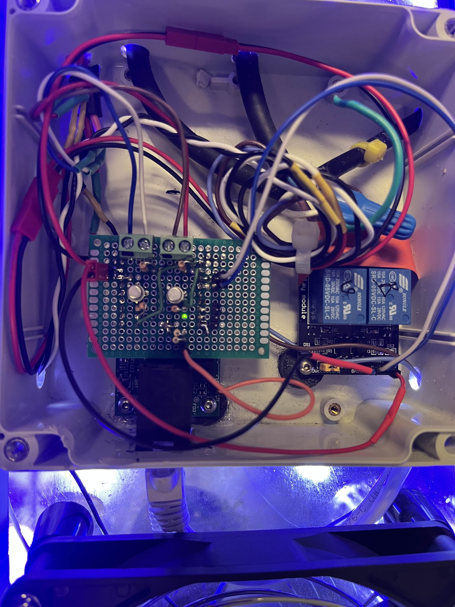
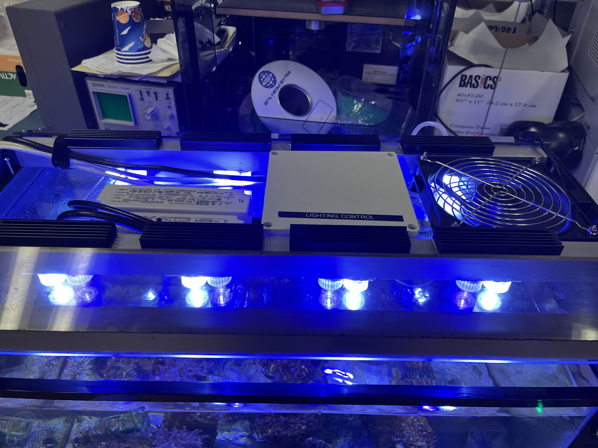

# Device-LED Lighting Control

The LED Lighting control device allows for control of the blue and white tank LEDs. The device uses two MEAN WELL constant current LED drivers to power the two series strings of eight LEDs each. A 10V PWM dimming signal provided using the node controller to the drivers to allow for day-night routines and manual control from the web app.

## Hardware

The provide the required 10V PWM signal to the LED drivers, first a zener diode is used to create a 10V rail from the 24V rail. Next this 10V is switched by the Node Controller using NPN transistor. Two channels are used, one for the white LEDs and one for the blue LEDs. A two channel relay module is used to switch the AC power being provided to the LED drivers since the drivers can not fully turn off using the dimming signal. The relays and the node controller are housed in a plastic enclosure the top of the tank next to the LED drivers.

## Firmware

Current firmware only supports a demo day lighting loop. Future versions would need to support a full day night cycle invloving a RTC 

## Message IDs and Formats

| Parameter | Message ID | Data Format |
| --------- | ---------- | ----------- |
|Dawn Demo Loop Time | 0x0A02 | Time in seconds
|Dusk Demo Loop Time | 0x0A03 | Time in seconds
|Sunrise Demo Loop Time | 0x0A04 | Time in seconds
|Sunset Demo Loop Time | 0x0A05 | Time in seconds
|Noon Demo Loop Time | 0x0A06 | Time in seconds
|Night Demo Loop Time | 0x0A07 | Time in seconds
|Blue Only Max Intensity | 0x0A08 | integer % 0 to 100
|Max White Intensity | 0x0A0E | integer % 0 to 100
|Max Blue Intensity | 0x0A0F | integer % 0 to 100
|Current White Intensity | 0x0A09 | interger PWM 0 to 255
|Current Blue Intensity | 0x0A0A | interger PWM 0 to 255
|Override White Intensity | 0x0A0C | interger PWM 0 to 255
|Override Blue Intensity | 0x0A0D | interger PWM 0 to 255
